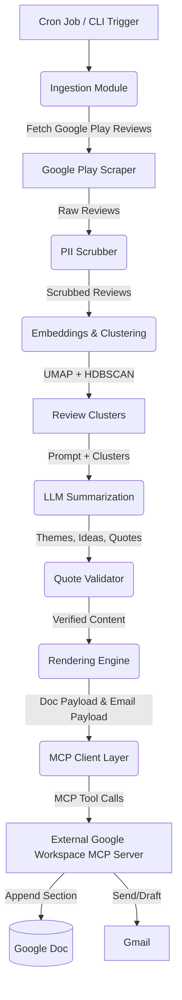

# Architecture: Weekly Product Review Pulse (Groww)

This document outlines the architecture for the Weekly Product Review Pulse, an automated system that ingests Google Play Store reviews for Groww, processes them into actionable themes, and delivers a stakeholder-friendly report via Google Docs and Gmail using an external Model Context Protocol (MCP) server.

---

## 1. High-Level System Overview

The system is designed as a modular, scheduled pipeline running once a week. It acts as an **MCP Client** that connects to a **Provided Google Workspace MCP Server** to perform the final delivery actions, eliminating the need to embed Google OAuth secrets directly in the agent's codebase.

The high-level workflow is:
**Ingest** $\rightarrow$ **Scrub** $\rightarrow$ **Cluster** $\rightarrow$ **Summarize** $\rightarrow$ **Render** $\rightarrow$ **Deliver (via MCP)**

---

## 2. Core Components

### 2.1 Orchestrator / CLI
- **Responsibility:** Trigger the pipeline on a scheduled cadence (e.g., Monday morning IST) or via manual CLI triggers for backfilling specific ISO weeks.
- **Key Features:** Passes the target product (`Groww`) and the time boundary (e.g., last 8–12 weeks) to the ingestion layer. Manages the overall idempotency of the run.

### 2.2 Data Ingestion Layer (Google Play)
- **Responsibility:** Fetch public reviews from the Google Play Store.
- **Key Features:** Uses a scraper-based approach to retrieve review text, rating, timestamp, and user identifiers. Filters reviews strictly within the configured time window.

### 2.3 Reasoning & NLP Pipeline
- **Responsibility:** Extract meaningful themes, quotes, and action items from raw review text.
- **Steps:**
  1. **PII Scrubbing:** Redact sensitive information (e.g., emails, phone numbers) before sending data to external APIs.
  2. **Embeddings:** Convert scrubbed review texts into dense vector embeddings (e.g., using OpenAI `text-embedding-3-small` or equivalent).
  3. **Clustering:** Use density-based clustering algorithms (UMAP for dimensionality reduction + HDBSCAN) to group semantically similar reviews into clusters.
  4. **LLM Summarization:** Pass the clustered reviews to an LLM to:
     - Name the theme.
     - Propose actionable product/support ideas.
     - Extract verbatim, representative quotes.
  5. **Validation:** A post-processing step ensures that the quotes extracted by the LLM exist verbatim in the original source text to prevent hallucinations.

### 2.4 Report Renderer
- **Responsibility:** Format the processed LLM outputs into two distinct payloads:
  - **Google Doc Section Payload:** A structured text/Markdown payload for the weekly pulse report.
  - **Email Teaser Payload:** A short HTML/text summary highlighting top themes with a "Read full report" call-to-action link.

### 2.5 Delivery Layer (MCP Client)
- **Responsibility:** Connect to the provided external Google Workspace MCP Server to dispatch the rendered payloads.
- **Key Features:**
  - Invokes specific MCP tools (e.g., `document_batch_update`, `gmail_draft_create`, `gmail_send`).
  - Stores delivery identifiers (Doc heading ID, Message ID) returned by the MCP server for auditing.

---

## 3. Data Flow Diagram

---

## 4. Detailed Design Considerations

### 4.1 MCP Server Integration
The provided MCP server handles all Google API interactions. The agent will discover and use tools exposed by the MCP server, such as:
- `append_to_doc`: To add the new weekly section.
- `create_heading_anchor`: To ensure the section is deep-linkable.
- `send_email` or `draft_email`: To send the summary email.
*Security Note:* Google credentials and OAuth flows are completely abstracted away from the agent codebase.

### 4.2 Idempotency and State Management
Running the pipeline for the same ISO week multiple times must not result in duplicate document sections or emails.
- **Docs Idempotency:** The agent first uses an MCP tool to read the Doc's structure or search for an existing header anchor (e.g., `[Week 42 - 2026] Groww Pulse`). If found, it skips the append or overwrites the specific section.
- **Email Idempotency:** The run logs (or local state database like SQLite) record the successfully dispatched ISO week email to prevent duplicate sends.

### 4.3 PII Scrubbing
Before any review leaves the local boundary to an Embedding or LLM API, a local PII scrubbing heuristic or library (e.g., `presidio-analyzer`) replaces names, phone numbers, and emails with placeholders like `[REDACTED]`.

### 4.4 Cost and Token Limits
- To avoid massive token consumption on high-volume weeks, the ingestion layer limits the maximum number of reviews passed to the clustering algorithm (e.g., sampling the most helpful, longest, or lowest-rated reviews if volume exceeds a threshold).
- The LLM summarization prompt is batched per cluster rather than processing the entire corpus in one monolithic call.

### 4.5 Auditing
Every run produces a local log containing:
- Run Timestamp & ISO Week.
- Total reviews ingested.
- Number of clusters generated.
- Cost/Token usage.
- Delivery status & generated Google Doc heading link.
